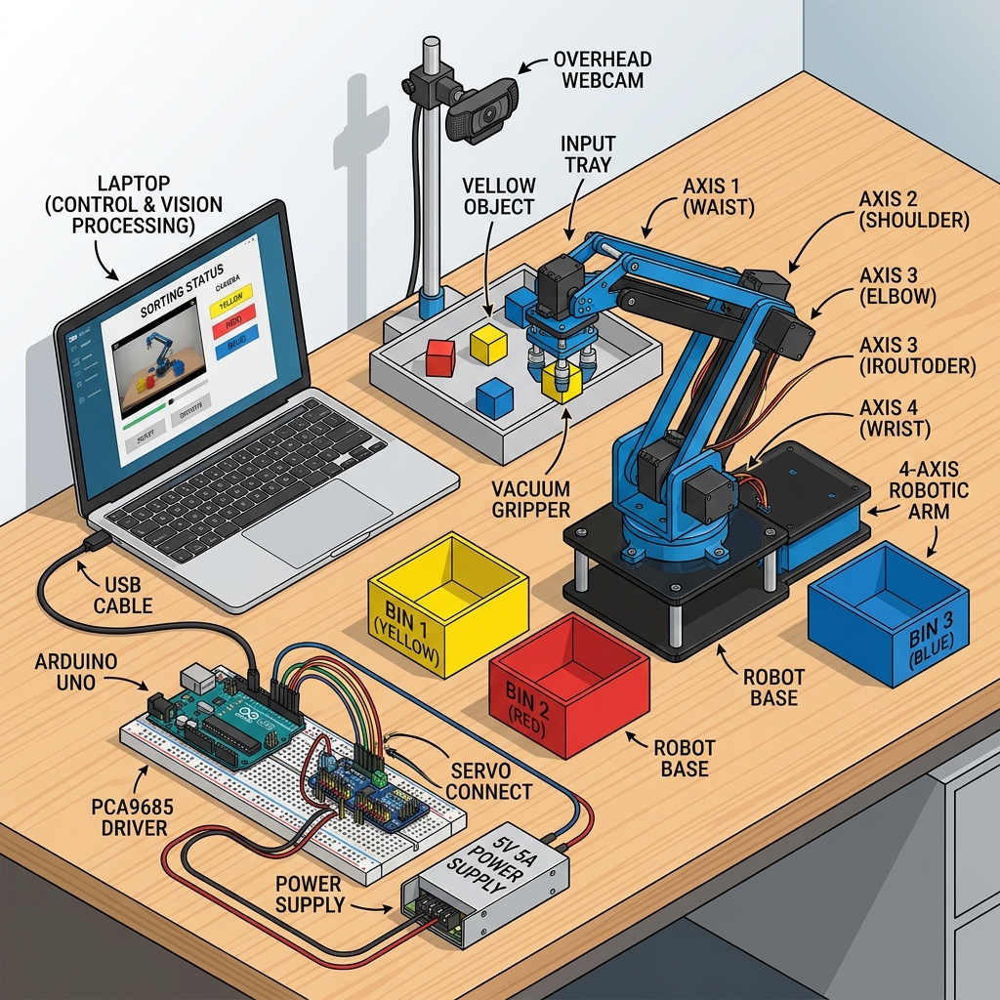
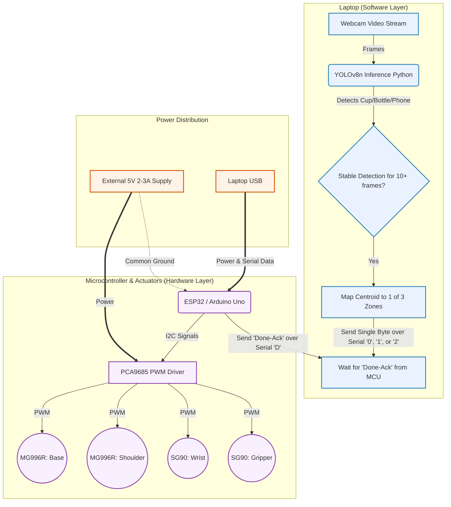

# Project A: Vision-Guided Object Sorting Arm - Hardware & Architecture Overview

> [!NOTE]
> This guide is designed specifically for the Hardware Engineer to understand the physical setup, power requirements, and the functional logic of the system.

## 1. Physical Layout & Component Setup

### Hardware Specifications to Ensure:
* **Microcontroller:** ESP32 or Arduino Uno.
* **Servos:**
  * 2x **MG996R metal-gear servos** for the Base and Shoulder (High torque is required here).
  * 2x **SG90 micro servos** for the Wrist and Gripper.
* **Servo Driver:** **PCA9685 PWM Driver** is strongly recommended for 4 servos to ensure stable signal distribution.
* **Power Supply:** **External 5V 2–3A power supply**. 
* **Webcam:** A standard USB webcam mounted directly above the sorting tray.

> [!CAUTION]
> **POWER RAILS:** Never power the servos directly off the Microcontroller's 5V pin. This will cause brownouts and random resets. Use the separate external power supply for the PCA9685 driver, and ensure there is a **common ground** between the external power supply, the PCA9685, and the microcontroller.

> [!IMPORTANT]
> **GRASP RELIABILITY:** Cheap servos have backlash. The gripper must close with consistent force. Consider adding a rubber or foam pad to the gripper fingers to improve friction and ensure items aren't dropped. Confirm every joint moves freely by hand before applying power.

## 2. Functional Architecture & Control Flow

The following diagram illustrates how the software and hardware interact. The heavy lifting (Computer Vision) happens on the laptop, which then simply tells the microcontroller "which predefined motion sequence" to run. No complex inverse kinematics are computed on the hardware.

### Communication Protocol
- The **laptop acts as the brain**. When an object is stable in a specific zone for ~10 frames, it sends a single ASCII digit (e.g., `0`, `1`, or `2`) over USB Serial.
- The **microcontroller receives the digit** and runs a pre-programmed, hardcoded series of waypoints: `Home -> Hover -> Lower -> Grip -> Lift -> Carry to Bin -> Release -> Home`.
- Once the physical sequence completes, the **microcontroller sends a `"D"` (Done-Ack)** back to the laptop to indicate it is ready for the next command. This handshaking prevents race conditions.
